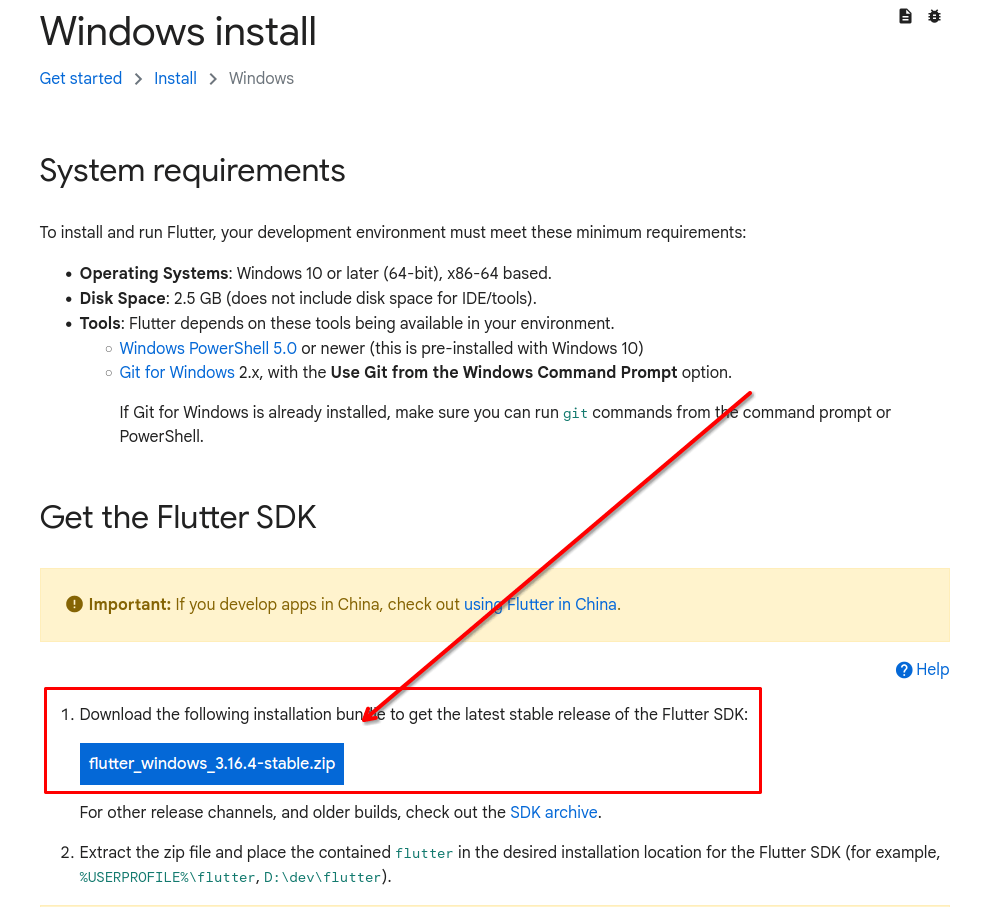
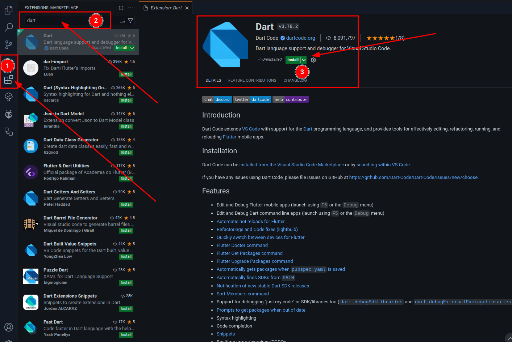
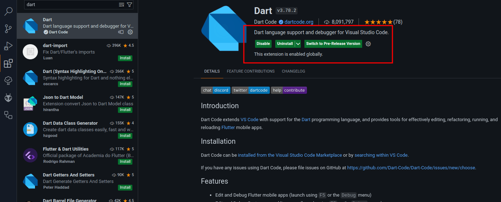

# Instalación y Configuración de Dart y Flutter

La manera mas sencilla de instalar Dart si sera usado en un futuro con Flutter, es desde su sitio oficial.

## Configuración en Windows

### Descargar Flutter

1. Descargar el archivo `zip` de la pagina oficial [Descarga](https://docs.flutter.dev/get-started/install/windows)

2. Una vez descargado, descomprimirlo y la carpeta generada, debe ser colocada en algun directorio seguro. Ejemplo
   1. `%USERPROFILE%\flutter`
   2. `D:\dev\flutter`

!!! Warning
    No guardarlo en `C:\Program Files\` porque requiere privilegios de administrador, ademas que no tiene caso.

### Configuración del `PATH`

Comprobar el path con dart y flutter, correr flutter doctor y ya, continuar en la seccion de flutter con android estudio

TODO: Verificar en la consola que todo funcione bien

## Editor de código

### Descargando e instalando Visual Studio Code

Para el uso de Dart (Con Flutter se vera después), vamos a utilizar Visual Studio Code.

!!! Note
      Descargar de su sitio oficial [Aquí](https://code.visualstudio.com/)

TODO: Agregar la imagen del sitio

TODO: Agregar la secuencia de la instalacion

## Agregando plugins a VS Code

1. Nos debemos ir a la sección de instalación de `Extensiones` de VS Code
2. En el buscador escribimos `dart`, para encontrar el plugin oficial
3. Damos en el botón de instalar, esperamos y quedara instalado

Verificamos que este instalado correctamente como se ve en la imagen

---

Realizando todo esto, nuestro entorno estará listo para comenzar a programar con dart.

[Información del sitio oficial](https://docs.flutter.dev/get-started/install/windows)
